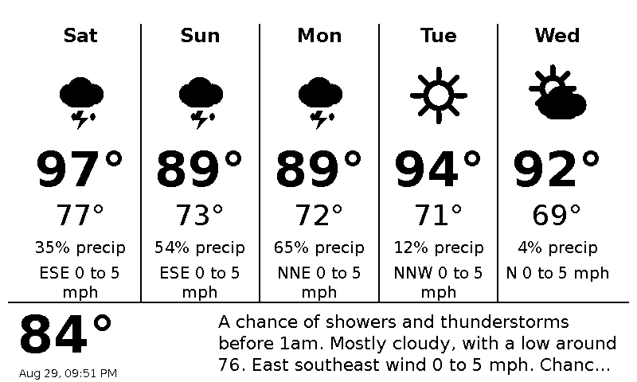

# trmnl-weather

Minimal, 1‑bit friendly 5‑day forecast for the TRMNL display (800×480). Pure HTML/CSS/JS with inline SVG icons and no runtime dependencies.

## Screenshot

**What it does**
- Renders a header with current temperature/conditions and last‑updated time
- Shows 5 days with icon, high/low, precip %, and wind
- Draws per‑day temperature range bars along the bottom
- Uses black/white only for crisp e‑paper screenshots

## Quick Start

Paste the html/javascript into the TRMNL console, fetch the JSON via API.

TRMNL injects data via Liquid variables. Drop `index.html` into your TRMNL app and map your data to the following Liquid values:
- `{{current|json}}`
- `{{forecast|json}}` (expects NOAA‑style `periods` with `isDaytime`)
- `{{location|json}}`

No external fonts or libraries are required.

## Data Shape

The renderer is flexible, but the simplest input is NOAA/NWS style:
- `current.timestamp`, `current.temperature.value`, `current.description`
- `forecast.periods[]` with `isDaytime`, `startTime`, `temperature`, optional `probabilityOfPrecipitation.value`, `windSpeed`, `windDirection`, `shortForecast`

`normalizeForecast(...)` also accepts alternative keys commonly returned by other APIs (e.g., `daily[]` with `high/low/pop/wind*`).

## Notes

- Designed for 800×480; fonts and line weights are tuned for readability from a distance.
- Icons are inline SVG; strokes use `vector-effect: non-scaling-stroke` for crisp rendering.
- Everything is self‑contained to simplify TRMNL deployment and screenshots.

## License

MIT — see `LICENSE`.
